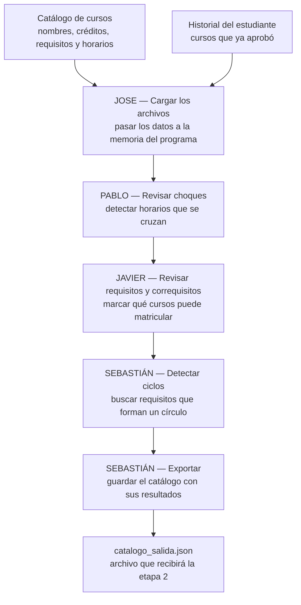

# CEmestre — Etapa 1 (Paradigma Imperativo, C)

> Parte 1 de 4 del proyecto [CEmestre](../README.md). Las demás etapas (Racket,
> Prolog, Java) viven en sus propias carpetas al nivel raíz del repositorio.

Programa en C que, a partir del catálogo de cursos de dos carreras y el
historial de un estudiante, calcula choques de horario, determina qué cursos
son matriculables según sus requisitos y correquisitos, detecta ciclos en el
grafo de requisitos y exporta el catálogo completo a un archivo JSON que sirve
de contrato para la siguiente etapa del proyecto (Racket).

## Equipo

| Integrante | Módulo |
|---|---|
| Jose | Carga de archivos |
| Pablo | Choques de horario |
| Javier | Requisitos, correquisitos y grafo |
| Sebastián | Exportación y detección de ciclos |

La distribución de tareas y el cronograma están en
[distribucion-tareas-etapa1-cemestre.md](distribucion-tareas-etapa1-cemestre.md).

## Cómo está organizado este documento

El README está dividido en las siguientes secciones. La última columna indica a
qué punto de los entregables del enunciado corresponde cada una.

| Sección | Contenido |
|---|---|---|
| 1. Arquitectura del proyecto | Flujo del programa, estructura de archivos, entradas y salida |
| 2. Compilar y ejecutar | Requisitos, comandos de compilación y ejecución |
| 3. Estructuras de datos compartidas | Los structs base de `estructuras.h` y sus límites | 
| 4. Módulos | Un apartado por integrante, cada uno con su arquitectura, decisiones de diseño y estructuras de datos | 
| 5. Casos límite encontrados | Requisitos que no existen en el catálogo y cómo se resolvieron | 
| 6. Justificación del formato de salida | Por qué JSON y qué decisiones de diseño lo motivaron | 
| 7. Pruebas | Cómo compilarlas y ejecutarlas, y los valores de referencia del dataset | 
| 8. Flujo de trabajo del repositorio | Ramas, pull requests e integración | 

## 1. Arquitectura del proyecto

### 1.1 Flujo del programa

El sistema completo no se conforma por un único ejecutable, ya que cada etapa del proyecto es un programa
independiente que lee y escribe archivos. Esta etapa toma dos archivos JSON de
entrada, los procesa en memoria a través de cuatro módulos encadenados, y
produce un tercer archivo JSON.



`main.c` encadena los módulos en ese orden. Cada uno recibe las estructuras en
memoria, agrega su resultado y se lo pasa al siguiente.

### 1.2 Estructura de archivos

```
.
├── include/
│   ├── constantes.h     # limites, códigos de error y rutas por defecto
│   ├── estructuras.h    # structs base: BloqueHorario, Grupo, Curso, Catalogo, Historial
│   ├── carga.h          # Modulo 1 (Jose): carga de catálogo/historial
│   ├── choques.h        # Modulo 2 (Pablo): choques de horario
│   ├── requisitos.h     # Modulo 3 (Javier): requisitos/correquisitos + grafo
│   └── exportacion.h    # Modulo 4 (Sebastian): exportación + detección de ciclos
├── src/
│   ├── main.c           # integración de los 4 módulos
│   ├── carga.c
│   ├── choques.c
│   ├── requisitos.c
│   └── exportacion.c
├── data/                # archivos de entrada y salida, todos JSON
├── tests/               # pruebas modulares
├── lib/cjson/           # cJSON vendorizada 
├── Makefile
└── distribucion-tareas-etapa1-cemestre.md
```

Cada módulo tiene su header en `include/` con las declaraciones públicas y su
implementación en `src/`. 

### 1.3 Entradas y salida

Los tres archivos son JSON. El esquema completo de cada uno: nombres de campo,
anidamiento, tipos, y cómo se recolectaron y limpiaron los datos está
documentado en **[`data/data_doc.md`](data/data_doc.md)**.

| Archivo | Rol |
|---|---|
| `data/catalogo.json` | Entrada. 45 cursos de los primeros 4 semestres de Ingeniería en Computadores e Ingeniería en Producción Industrial. |
| `data/historial.json` | Entrada. 25 códigos de cursos ya aprobados por un estudiante de prueba. |
| `data/catalogo_salida.json` | Salida. El catálogo completo más los campos calculados. Contrato con la etapa 2. |

## 2. Compilar y ejecutar

Requiere `gcc` y `make`.

> **Windows:** correr `make` desde **Git Bash** (no PowerShell ni cmd.exe). El
> Makefile usa comandos estilo Unix (`rm -rf`, `mkdir -p`) 
> si `make` no encuentra un shell POSIX (`sh.exe`) en el PATH, cae de vuelta a `cmd.exe`,
> que no entiende esos comandos y falla con errores como
> `CreateProcess(NULL, rm -rf build bin, ...) failed`. Git Bash ya viene
> instalado junto con Git y resuelve esto sin tocar el Makefile.

```bash
make            # compila bin/cemestre
make run        # compila y ejecuta con las rutas por defecto de constantes.h
make clean      # borra los artefactos de compilacion (build/, bin/)
```

Rutas por defecto (ver `include/constantes.h`): `data/catalogo.json`,
`data/historial.json`, `data/catalogo_salida.json`. También se pueden pasar
como argumentos:

```bash
./bin/cemestre data/catalogo.json data/historial.json data/catalogo_salida.json
```

El programa imprime por `stderr` un aviso por cada requisito que no logra
resolver dentro del catálogo. Con el dataset actual son dos avisos, ambos del
curso `CI1230`.

## 3. Estructuras de datos compartidas

Definidas en `include/estructuras.h`, con los límites en `include/constantes.h`.
Son el contrato contra el que trabajan los cuatro módulos.

Los structs se acordaron entre los cuatro desde el primer commit, antes de
repartir los módulos, para que todos trabajaran contra el mismo contrato.

**`BloqueHorario`.** `dia` es un solo `char` y no un string porque solo puede
tomar seis valores fijos (`'L','K','M','J','V','S'`); un `char` es más barato
y compararlo es una sola instrucción. Se usa `'K'` para martes porque `'M'` ya
está ocupado por miércoles. `hora_inicio`/`hora_fin` se guardan como `int` en
formato `HHMM` (`730` = 7:30, `1500` = 15:00) en vez de un string `"07:30"`,
para poder compararlas directo con `<`/`>` sin parsear nada — que es
justo lo que necesita el módulo de choques.

**`Grupo`.** Tiene un arreglo de `BloqueHorario` y no un solo bloque porque un
mismo grupo se puede reunir varios días distintos. Por ejemplo, `CE1101` grupo
1 tiene clase martes y jueves: son dos bloques del mismo grupo, no dos grupos.

**`Curso`.** `carreras` es un arreglo (`carreras[MAX_CARRERAS]`) y no un solo
campo porque hay cursos que pertenecen a las dos carreras del catálogo a la
vez — `MA1102` lo llevan tanto Computadores como Producción Industrial.
Guardarlo así evita duplicar la entrada completa del curso una vez por
carrera.

**`Catalogo` e `Historial`.** Los dos usan arreglos de tamaño fijo
(`Curso cursos[MAX_CURSOS]`, `char aprobados[MAX_CURSOS][MAX_LONG_CODIGO]`) en
vez de memoria reservada con `malloc`. A cambio de un tope fijo de cursos
(`MAX_CURSOS`), no hay ningún puntero dentro de estos structs — por eso
`liberar_catalogo()` y `liberar_historial()` no llaman a `free()` en ningún
lado, solo reinician `cantidad_cursos`/`cantidad_aprobados` a 0.

**Constantes en archivo aparte.** Todos los límites (`MAX_CURSOS`,
`MAX_GRUPOS`, `MAX_LONG_CODIGO`, etc.) están en `constantes.h` y no como
números sueltos dentro de `estructuras.h`. Es requisito explícito del
enunciado (punto 6 de "Aspectos operativos") y de paso permite ajustar los
topes sin tocar la forma de los structs.

## 4. Módulos

### 4.1 Módulo de carga — Jose

Archivos: `include/carga.h`, `src/carga.c`.

#### 4.1.1 Arquitectura

El módulo de carga es el primer paso del flujo: `main.c` lo llama antes que a
cualquier otro módulo, porque choques y requisitos necesitan el catálogo y el
historial ya en memoria para trabajar. Recibe la ruta de dos archivos JSON
(`catalogo.json`, `historial.json`) y entrega las estructuras `Catalogo` y
`Historial` ya llenas.

Expone 4 funciones públicas (declaradas en `carga.h`): `cargar_catalogo()`,
`cargar_historial()`, `liberar_catalogo()` y `liberar_historial()`.
Internamente se apoya en 4 funciones `static` que no están en el header
porque ningún otro módulo las necesita:

- `leer_archivo_completo()`: abre el archivo y lo lee entero a un buffer.
- `copiar_seguro()`: copia un string a un campo fijo del struct sin
  desbordarlo.
- `cargar_lista_codigos()`: copia un arreglo JSON de strings a un arreglo de
  códigos del struct — la reutilizan requisitos, correquisitos y aprobados.
- `cargar_curso()`: arma un `Curso` completo a partir de un nodo del arreglo
  `"cursos"` del JSON, apoyándose en las tres anteriores.

#### 4.1.2 Decisiones de diseño

**cJSON en vez de un parser propio.** Un parser de JSON que soporte objetos
anidados (curso → grupos → bloques) es un proyecto aparte, y un bug ahí
afecta a los otros tres módulos que dependen de que el catálogo cargue bien.
Se vendorizó cJSON en `lib/cjson/` (justificación completa en
[`lib/cjson/README.md`](lib/cjson/README.md)); en el `Makefile` esto significa
compilar `lib/cjson/cJSON.c` como un archivo más del proyecto y enlazarlo al
ejecutable, sin `-Wall -Wextra` porque es código de terceros que no se va a
tocar.

**Archivo completo a memoria, no línea por línea.** JSON no es un formato por
líneas: un curso puede estar repartido en muchas líneas o en una sola según
cómo se guardó el archivo. `leer_archivo_completo()` lee todo de una vez a un
buffer con `malloc`, respetando el tope `MAX_TAMANO_JSON` de `constantes.h`
para no reservar memoria sin límite si el archivo viniera corrupto o
gigante. Ese buffer se libera con `free()` apenas termina el parseo, no queda
guardado en ningún struct.

**Modo binario (`"rb"`), no texto.** Con `"rb"`, el tamaño que reporta
`ftell()` coincide exacto con lo que después lee `fread()`. En modo texto,
Windows traduce los saltos de línea (`\r\n` → `\n`) y ese conteo queda
desalineado.

**`copiar_seguro()` en vez de `strcpy()`.** `strcpy()` no sabe el tamaño del
buffer destino; si un nombre de curso en el JSON fuera más largo que
`MAX_LONG_NOMBRE`, escribiría fuera de los límites del struct.
`copiar_seguro()` usa `strncpy()` y agrega el `'\0'` final a mano, porque
`strncpy()` no lo garantiza cuando el string de origen es igual o más largo
que el límite.

**Campos obligatorios vs. opcionales.** `codigo`, `nombre` y `creditos` son
obligatorios: si a un curso le falta alguno, `cargar_curso()` corta el
parseo completo con `ERROR_FORMATO`. `carreras`, `requisitos`,
`correquisitos` y `grupos` pueden venir vacíos (`[]`) sin que sea un error —
en el dataset real hay cursos sin requisitos (`CE1101`) o sin correquisitos,
y eso es un dato válido, no uno faltante.

**Códigos de retorno.** `ERROR_ARCHIVO` si el archivo no existe o no se puede
leer; `ERROR_FORMATO` si el JSON no es válido, si falta la clave esperada
(`"cursos"` o `"aprobados"`), o si a un curso le falta un campo obligatorio;
`ERROR_MEMORIA` si el catálogo trae más cursos de los que caben en
`MAX_CURSOS`. `EXITO` en cualquier otro caso.

#### 4.1.3 Estructuras de datos

Los nombres de campo del JSON (esquema completo en
[`data/data_doc.md`](data/data_doc.md)) son idénticos a los del struct a
propósito — `codigo`, `nombre`, `creditos`, `carreras`, `requisitos`,
`correquisitos`, `grupos`, `numero_grupo`, `bloques`, `dia`, `hora_inicio`,
`hora_fin` — así que `cargar_curso()` es un mapeo directo: por cada campo del
struct hay un `cJSON_GetObjectItemCaseSensitive()` con exactamente el mismo
nombre, sin tabla de traducción de por medio.

El único campo que cambia de tipo en el mapeo es `dia`: en el JSON es un
string de un carácter (`"M"`, por ejemplo), porque JSON no tiene un tipo
char, pero en `BloqueHorario` es un `char`. `cargar_curso()` toma el primer
carácter de ese string (`valuestring[0]`) y lo guarda directo.

`choca_con_otro` y `matriculable` son los únicos dos campos de `Curso` que no
vienen del JSON de entrada — los calculan los módulos de choques y
requisitos más adelante. Se inicializan en 0 al cargar, para que ningún curso
quede con memoria sin inicializar antes de que esos módulos corran.

### 4.2 Módulo de choques de horario — Pablo

Archivos: `include/choques.h`, `src/choques.c`.

#### 4.2.1 Arquitectura

Este módulo es el encargado de  determinar si existen dos o mas cursos con el mismo horario en el catalgo de los cursos, se ejecuta luego de cargar el catálogo.

El módulo esta dividido en tres funciones: `bloques_se_solapan()`, esta recibe dos bloques de horarios, es decir, determina si los intervalos de tiempo interfieren el uno con el otro, mismo día y a la misma hora o una hora que interfiera, por ejemplo bloque 7:30/9:30 y 8:20/10:30
 `grupos_chocan()`: esta funcion recibe dos grupos y compara los bloques horarios reutilizando `bloques_se_solapan()` para determinar si existe solapamiento de un par de horarios
 `calcular_choques()`: recorre los cursos del catálogo y compara los grupos de cada par de curso utilizando las funciones anteriores, si una de las funciones salta esta función modifica el campo `choca_con_otro` de ambos cursos en el catálogo.

la responsabilidad del módulo es unicamente de detectar conglictos y registrarlos en el catálogo para su utilidad en las siguientes etapas del proyecto.

#### 4.2.2 Decisiones de diseño

##### Intervalos de horario
Para deteerminar si dos bloques se solapan se utiliza un intervalo tipo: `[hora_inicio, hora_fin)`.

Esto con el fin de que si un curso termina a las 9:30 y otro empieza a esa misma hora no se considera como un choque de horarios.
Se utiliza la siguiente condición `inicioA < finB && inicioB < finA`, verifica que ambos bloques se llevan el mismo día, dos bloques con las mismas horas pero diferente dia no representa un conflicto

##### Representación de las horas
Las horas se almacenan como números enteros en formato HHMM. Por ejemplo:

- `730` representa las 7:30.
- `920` representa las 9:20.
- `1500` representa las 15:00.
No es necesario convertir estas horas a minutos, ya que el valor entero mantiene el orden cronológico.

##### Comparación entre cursos distintos
Se detectan choques solo entre grupos pertenecientes a cursos distintos, un estudiante solo escogería un grupo de un mismo curso para matricular.

#### 4.2.3 Estructuras de datos

El módulo de choques no define estructuras de datos propias. Utiliza las
estructuras compartidas definidas en `estructuras.h`.

Las principales estructuras utilizadas son:

- `BloqueHorario`: utiliza los campos `dia`, `hora_inicio` y `hora_fin` para
  determinar si dos bloques se superponen.

- `Grupo`: utiliza el arreglo `bloques` y el campo `cantidad_bloques` para
  comparar todos los bloques de dos grupos.

- `Curso`: utiliza el arreglo `grupos`, `cantidad_grupos` y el campo
  `choca_con_otro`. Este último es el resultado que modifica el módulo.

- `Catalogo`: utiliza el arreglo de cursos y `cantidad_cursos` para recorrer
  todos los pares de cursos que deben compararse.

No fue necesario crear una estructura auxiliar para almacenar los choques,
porque el requerimiento de esta etapa únicamente necesita registrar si un curso
presenta o no al menos un conflicto. El resultado puede almacenarse directamente
en el campo `choca_con_otro` de cada curso.

### 4.3 Módulo de requisitos y matriculabilidad — Javier

#### 4.3.1 Arquitectura

Este módulo define, para cada curso de catálogo, si el estudiante puede matricularlo,
según los requisitos y correquisitos del mismo.
Esto se logra comparando los requisitos y correquisitos declarados por
el curso contra el historial de cursos aprobados, y queda escrita en el campo
`matriculable` de cada curso.

Además, construye el **grafo de requisitos**, una lista de adyacencia donde cada
curso apunta a los cursos que son requisito directo suyo.

Entra al flujo en dos momentos: `determinar_matriculable()` lo llama `main.c`
después del cálculo de choques, y `construir_grafo_requisitos()` lo llama
`detectar_ciclos()` desde `exportacion.c`. Las dos entradas son independientes
entre sí.

En `main.c` se hace la llamada a `determinar_matriculable()` después del cálculo de choques,
y `construir_grafo_requisitos()` se llama desde `exportacion.c`. Ambas entradas son independientes
entre sí.

#### 4.3.2 Decisiones de diseño

- **Semántica de correquisitos.** Un correquisito se debe llevar al mismo tiempo que
  el curso, así que no se puede exigir que esté aprobado. Un correquisito 
  se cumple si ya está aprobado, o si existe en el catálogo. Esta condición no es
  recursiva ya que en el dataset hay correquisitos mutuos.
  Por ejemplo: (`QU1102`↔`QU1106` y `QU1104`↔`QU1107`) donde una implementación recursiva
  no terminaría.
- **`matriculable` no toma en cuenta `choca_con_otro`.** La etapa de choque
  entre dos cursos no corresponde a la etapa1-c, esto es resuelto durante la etapa
  de etapa2-racket.
- **Los cursos ya aprobados quedan en `matriculable = 0`.** Se les define este valor
  a los cursos que el estudiante puede matricular ese semestre.
- **El grafo guarda índices, no códigos.** El DFS salta de nodo a nodo, ya que
  al utilziar índices el salto es directo, con strings cada paso sería una búsqueda lineal.

#### 4.3.3 Estructuras de datos

El módulo define `GrafoRequisitos` en `include/requisitos.h` una lista de
adyacencia sobre arreglos estáticos, donde `adyacentes[i][k]` es el índice del
k-ésimo curso que es requisito del curso `i`, `cantidad_adyacentes[i]` cuántos
tiene, y `cantidad_nodos` el total de nodos. Una arista `i -> j` se lee como
"el curso i tiene como requisito al curso j".

De las estructuras compartidas lee `codigo`, `requisitos[]`, `correquisitos[]`
y `aprobados[]`, y define únicamente `matriculable`.

Sobre el dataset real define 12 cursos matriculables de 45, y un grafo de 45
nodos con 35 aristas.

### 4.4 Módulo de exportación y detección de ciclos — Sebastián

Archivos: `include/exportacion.h`, `src/exportacion.c`.

#### 4.4.1 Arquitectura

El módulo exporta el catálogo completo mediante cJSON y detecta ciclos
utilizando el grafo construido por el módulo de requisitos.

Funciones públicas:
- exportar_catalogo(): guarda los cursos y el reporte de ciclos en JSON.
- dfs_detectar_ciclo(): busca ciclos alcanzables desde un nodo.
- detectar_ciclos(): recorre todos los componentes y reporta los ciclos
  en terminal.

En main.c, después de calcular choques y matriculabilidad, se llama a
detectar_ciclos() y luego a exportar_catalogo(). La exportación calcula
su propio reporte.

#### 4.4.2 Decisiones de diseño

Se utiliza JSON para representar cursos, grupos y horarios y facilitar
su lectura desde Racket. Se conserva todo el catálogo, incluidos cursos
no matriculables, y los indicadores se escriben como booleanos.

Antes de serializar se validan los contadores y terminadores de cadenas.
El JSON se construye antes de abrir el destino para evitar truncarlo si
falla una asignación de memoria. Un error durante la escritura sí puede
dejar un archivo parcial.

Los correquisitos no participan en el DFS porque pueden representar
matrícula simultánea. Los ciclos se reportan tanto en terminal como en
el archivo de salida.

#### 4.4.3 Estructuras de datos

El DFS utiliza:
- visitados: nodos ya explorados.
- en_pila: nodos activos en el recorrido; volver a uno identifica un ciclo.
- camino: permite recuperar los códigos involucrados.

La salida contiene cursos, ciclos y hay_ciclos. Cada ciclo repite
su código inicial al final, por ejemplo ["A", "B", "A"]. Si no hay ciclos,
se exportan [] y false. Se reportan los caminos cerrados encontrados
por DFS, no todas las combinaciones posibles de ciclos simples.

## 5. Casos límite encontrados

CI1230 requiere CI0200 y CI0202, ausentes del catálogo. El grafo
omite esas conexiones y emite avisos; la exportación conserva los códigos.

La validación los busca en el historial. Como no aparecen aprobados en
el historial de prueba, CI1230 queda no matriculable. No se pueden
detectar ciclos que atraviesen cursos ausentes del catálogo.
Requisitos que no existen en el catálogo: `CI1230` (Inglés I) declara los
requisitos `CI0200` y `CI0202`, cursos de nivelación que no están en el
catálogo de los primeros 4 semestres. 
Son los únicos dos casos del dataset de los 37 requisitos declarados, 35 se resuelven y estos 2 no.

El grafo omite esas aristas y avisa por `stderr`, porque no puede apuntar a
un nodo inexistente. La exportación conserva ambos códigos en el archivo de
salida; y la validación de requisitos sí los cuenta como incumplidos, así
que `CI1230` queda con `matriculable: false`. El tratamiento distinto en cada
módulo es deliberado, ya que el grafo sirve para verificar integridad de los datos y
la validación para decidir matrícula.

## 6. Justificación del formato de salida

JSON conserva la estructura anidada y los nombres de los campos del
catálogo. Carreras permite identificar cursos compartidos sin duplicarlos,
y los booleanos facilitan interpretar los resultados desde Racket.

Ciclos y hay_ciclos se ubican junto a cursos porque describen relaciones
entre varios cursos. La salida incluye el catálogo completo para que la
siguiente etapa no necesite combinarlo con el archivo de entrada.

El esquema completo del archivo de salida está en
[`data/data_doc.md`](data/data_doc.md).

## 7. Pruebas

Cada módulo tiene sus pruebas en `tests/`, en una carpeta por módulo. Se
compilan por separado y la mayoría arma las estructuras a mano en memoria, sin
depender de los archivos de datos. La única excepción es
`test_ciclos_json.c`, que sí carga `data/catalogo.json` para verificar la
exportación sobre el catálogo real.

Todos los comandos se ejecutan desde `etapa1-c/`.

```bash
# requisitos y correquisitos (Javier) — 8 casos
gcc -Wall -Wextra -std=c11 -Iinclude -Ilib/cjson -g \
    tests/requisitos/test_requisitos.c src/requisitos.c -o build/test_requisitos && \
    ./build/test_requisitos

# grafo de requisitos (Javier) — 4 casos
gcc -Wall -Wextra -std=c11 -Iinclude -Ilib/cjson -g \
    tests/grafo-requisitos/test_grafo.c src/requisitos.c -o build/test_grafo && \
    ./build/test_grafo

# deteccion de ciclos (Sebastián) — 6 casos
gcc -Wall -Wextra -std=c11 -Iinclude -Ilib/cjson -g \
    tests/exportacion-ciclos/test_exportacion.c src/exportacion.c src/requisitos.c \
    lib/cjson/cJSON.c -o build/test_exportacion && \
    ./build/test_exportacion

# ciclos en el JSON de salida (Sebastián) — 5 casos
gcc -Wall -Wextra -std=c11 -Iinclude -Ilib/cjson -g \
    tests/exportacion-ciclos/test_ciclos_json.c src/exportacion.c src/requisitos.c \
    src/carga.c lib/cjson/cJSON.c -o build/test_ciclos_json && \
    ./build/test_ciclos_json
```

`test_ciclos_json.c` enlaza además con `src/carga.c`, porque necesita
`cargar_catalogo()` para leer el catálogo real.

### Qué cubre cada suite

| Suite | Casos |
|---|---|
| `tests/requisitos/test_requisitos.c` | Búsqueda en el historial, cursos con y sin requisitos, requisito no aprobado, requisito fuera del catálogo, curso ya aprobado, correquisitos mutuos sin recursión, y guardas de `NULL`. |
| `tests/grafo-requisitos/test_grafo.c` | Cadena de requisitos, requisito inexistente que se omite sin romper índices, ciclo que sí queda representado en el grafo, y guardas de `NULL`. |
| `tests/exportacion-ciclos/test_exportacion.c` | Cadena sin ciclos, requisito compartido sin falso positivo, ciclo de tres cursos, autorrequisito, ciclo en un componente separado, llamada directa al DFS, y catálogo vacío o nulo. |
| `tests/exportacion-ciclos/test_ciclos_json.c` | Diamante sin falso ciclo, ciclos de todos los componentes guardados en el JSON, exportaciones consecutivas sin datos viejos, manejo de fallos de memoria, y conservación de los 45 cursos reales con todos sus campos. |

En total son 23 casos entre las cuatro suites.


### Valores de referencia sobre el dataset real

Sirven para verificar cualquier cambio futuro:

| Métrica | Valor |
|---|---|
| Cursos cargados | 45 |
| Cursos aprobados en el historial | 25 |
| Cursos matriculables | 12 |
| Grupos / bloques horarios | 206 / 295 |
| Requisitos declarados / sin resolver | 37 / 2 |
| Nodos y aristas del grafo | 45 / 35 |
| Ciclos detectados | 0 |

## 8. Flujo de trabajo del repositorio

- `main` recibe únicamente los merges de `develop` ya verificados (build limpio
  y módulos probados). 
- `develop` es la rama de integración: todo el trabajo del día a día pasa por
  ahí.
- Cada quién trabaja en su rama de feature a partir de `develop`
  (`feature/cargar-horarios`, `feature/choques`, `feature/requisitos`,
  `feature/grafo-requisitos`, `feature/exportacion-ciclos`) y la integra a
  `develop` mediante pull request conforme se prueba.
- `main.c` se completa en conjunto, en `develop`, una vez que cada módulo está
  probado por separado.
- Cuando la etapa está completa y verificada en `develop`, se hace merge a
  `main` como entrega final.