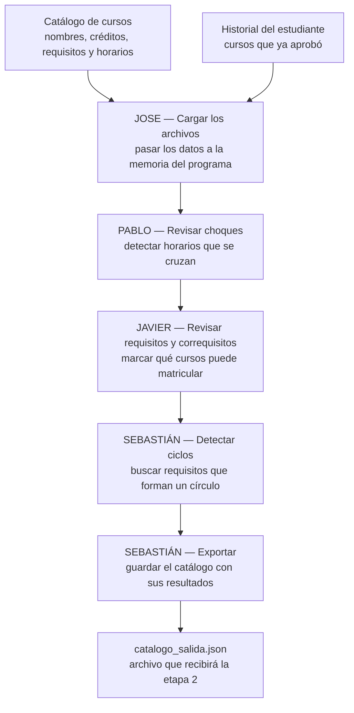

# CEmestre — Etapa 1 (Paradigma Imperativo, C)

> Parte 1 de 4 del proyecto [CEmestre](../README.md). Las demás etapas (Racket,
> Prolog, Java) viven en sus propias carpetas al nivel raíz del repositorio.

Programa en C que, a partir del catálogo de cursos de dos carreras y el
historial de un estudiante, calcula choques de horario, determina qué cursos
son matriculables según sus requisitos y correquisitos, detecta ciclos en el
grafo de requisitos y exporta el catálogo completo a un archivo JSON que sirve
de contrato para la siguiente etapa del proyecto (Racket).

## Equipo

| Integrante | Módulo |
|---|---|
| Jose | Carga de archivos |
| Pablo | Choques de horario |
| Javier | Requisitos, correquisitos y grafo |
| Sebastián | Exportación y detección de ciclos |

La distribución de tareas y el cronograma están en
[distribucion-tareas-etapa1-cemestre.md](distribucion-tareas-etapa1-cemestre.md).

## Cómo está organizado este documento

El enunciado pide documentar arquitectura (2.1), decisiones de diseño (2.2) y
estructuras de datos (2.3). Este README los cubre así:

| Punto del enunciado | Dónde está |
|---|---|
| 2.1 Arquitectura del proyecto | Sección 1, y el apartado *Arquitectura* de cada módulo en la sección 4 |
| 2.2 Decisiones de diseño | Sección 3 (transversales) y el apartado *Decisiones de diseño* de cada módulo |
| 2.2.2 Caso límite real | Sección 5 |
| 2.2.3 Justificación del formato de salida | Sección 6 |
| 2.3 Estructuras de datos | Sección 2 (compartidas) y el apartado *Estructuras de datos* de cada módulo |

---

## 1. Arquitectura del proyecto

### 1.1 Flujo del programa

El sistema no es un único ejecutable: cada etapa del proyecto es un programa
independiente que lee y escribe archivos. Esta etapa toma dos archivos JSON de
entrada, los procesa en memoria a través de cuatro módulos encadenados, y
produce un tercer archivo JSON.



`main.c` encadena los módulos en ese orden. Cada uno recibe las estructuras en
memoria, agrega su resultado y se lo pasa al siguiente; ninguno lee ni escribe
archivos salvo el primero y el último.

<!-- EQUIPO: si cambia el orden de llamadas en main.c, actualizar el diagrama. -->

### 1.2 Estructura de archivos

```
.
├── include/
│   ├── constantes.h     # limites, codigos de error y rutas por defecto
│   ├── estructuras.h    # structs base: BloqueHorario, Grupo, Curso, Catalogo, Historial
│   ├── carga.h          # Modulo 1 (Jose): carga de catalogo/historial
│   ├── choques.h        # Modulo 2 (Pablo): choques de horario
│   ├── requisitos.h     # Modulo 3 (Javier): requisitos/correquisitos + grafo
│   └── exportacion.h    # Modulo 4 (Sebastian): exportacion + deteccion de ciclos
├── src/
│   ├── main.c           # integracion de los 4 modulos
│   ├── carga.c
│   ├── choques.c
│   ├── requisitos.c
│   └── exportacion.c
├── data/                # archivos de entrada y salida, todos JSON
├── docs/                # documentacion detallada por modulo
├── tests/               # pruebas por modulo
├── lib/cjson/           # cJSON vendorizada (parseo/serializacion de JSON)
├── Makefile
└── distribucion-tareas-etapa1-cemestre.md
```

Cada módulo tiene su header en `include/` con las declaraciones públicas y su
implementación en `src/`. Los headers son el contrato entre módulos: un cambio
ahí afecta a todo el equipo.

### 1.3 Entradas y salida

Los tres archivos son JSON. El esquema completo de cada uno —nombres de campo,
anidamiento, tipos, y cómo se recolectaron y limpiaron los datos— está
documentado en **[`data/README.md`](data/README.md)**.

| Archivo | Rol |
|---|---|
| `data/catalogo.json` | Entrada. 45 cursos de los primeros 4 semestres de Ingeniería en Computadores e Ingeniería en Producción Industrial. |
| `data/historial.json` | Entrada. 25 códigos de cursos ya aprobados por un estudiante de prueba. |
| `data/catalogo_salida.json` | Salida. El catálogo completo más los campos calculados. Contrato con la etapa 2. |

---

## 2. Compilar y ejecutar

Requiere `gcc` y `make`.

> **Windows:** correr `make` desde **Git Bash** (no PowerShell ni cmd.exe). El
> Makefile usa comandos estilo Unix (`rm -rf`, `mkdir -p`); si `make` no
> encuentra un shell POSIX (`sh.exe`) en el PATH, cae de vuelta a `cmd.exe`,
> que no entiende esos comandos y falla con errores como
> `CreateProcess(NULL, rm -rf build bin, ...) failed`. Git Bash ya viene
> instalado junto con Git y resuelve esto sin tocar el Makefile.

```bash
make            # compila bin/cemestre
make run        # compila y ejecuta con las rutas por defecto de constantes.h
make clean      # borra los artefactos de compilacion (build/, bin/)
```

Rutas por defecto (ver `include/constantes.h`): `data/catalogo.json`,
`data/historial.json`, `data/catalogo_salida.json`. También se pueden pasar
como argumentos:

```bash
./bin/cemestre data/catalogo.json data/historial.json data/catalogo_salida.json
```

El programa imprime por `stderr` un aviso por cada requisito que no logra
resolver dentro del catálogo. Con el dataset actual son dos avisos, ambos del
curso `CI1230`; no son errores (ver sección 5).

---

## 3. Estructuras de datos compartidas

Definidas en `include/estructuras.h`, con los límites en `include/constantes.h`.
Son el contrato contra el que trabajan los cuatro módulos.

<!-- EQUIPO (idealmente Jose, que definió los structs):
     Explicar cada struct y por qué se modeló así. Puntos a cubrir:
     - BloqueHorario: por que el dia es un char y las horas son int en formato
       HHMM en vez de strings, y por que se usa 'K' para martes.
     - Grupo: por que un grupo tiene un arreglo de bloques y no uno solo.
     - Curso: por que 'carreras' es un arreglo (cursos compartidos entre los dos
       planes) en vez de duplicar la entrada del curso.
     - Catalogo e Historial: por que arreglos estaticos y no memoria dinamica,
       y que implica eso para liberar_catalogo/liberar_historial.
     - Mencionar por que las constantes viven en un archivo aparte
       (es requisito explicito del enunciado). -->

---

## 4. Módulos

### 4.1 Módulo de carga — Jose

Archivos: `include/carga.h`, `src/carga.c`.

#### 4.1.1 Arquitectura

<!-- JOSE: que hace el modulo dentro del flujo, que recibe y que entrega.
     Mencionar las funciones publicas (cargar_catalogo, cargar_historial,
     liberar_catalogo, liberar_historial) y los helpers internos
     (leer_archivo_completo, copiar_seguro, cargar_lista_codigos,
     cargar_curso). Quien lo llama: main.c, antes que todos los demas. -->

#### 4.1.2 Decisiones de diseño

<!-- JOSE: justificar con ejemplos del dataset. Puntos sugeridos:
     - Por que cJSON vendorizada en lugar de un parser propio
       (ver lib/cjson/README.md) y que implica para la compilacion.
     - Por que se lee el archivo completo a memoria con MAX_TAMANO_JSON
       en vez de parsear linea por linea.
     - Por que se abre en modo binario "rb" y no en modo texto.
     - Por que se usa strncpy con terminador explicito (copiar_seguro)
       en vez de strcpy.
     - Que campos se consideran obligatorios (codigo, nombre, creditos ->
       ERROR_FORMATO si faltan) y cuales opcionales (grupos, requisitos y
       correquisitos vacios son validos, no son error).
     - Los codigos de error de constantes.h y cuando se devuelve cada uno. -->

#### 4.1.3 Estructuras de datos

<!-- JOSE: como se mapea el JSON a los structs. El detalle importante es que
     los nombres de campo del JSON son identicos a los de los struct, a
     proposito, para que el parseo sea un mapeo directo. Mencionar el caso del
     campo 'dia', que en JSON es string de un caracter y en el struct es char. -->

---

### 4.2 Módulo de choques de horario — Pablo

Archivos: `include/choques.h`, `src/choques.c`.

#### 4.2.1 Arquitectura

este modulo es el encargado de  determinar si existen dos o mas cursos con el mismo horario en el catalgo de los cursos, se ejecuta luego de cargar el catalogo.

el modulo esta dividido en tres funciones: `bloques_se_solapan()`, esta recibe dos bloques de horarios, es decir, determina si los intervalos de tiempo interfieren el uno con el otro, mismo dia y a la misma hora o una hora que interfiera, por ejemplo bloque 7:30/9:30 y 8:20/10:30
 `grupos_chocan()`: esta funcion recibe dos grupos y compara los bloques horarios reutilizando `bloques_se_solapan()` paea determinar si existe solapamiento de un par de horarios
 `calcular_choques()`: recorre los cursos del catalogo y compara los grupos de cada par de curso utilizando las funciones anteriores, si una de las funciones salta esta funcion modifica el campo `choca_con_otro` de ambos cursos en el catalogo.

la responsabilidad del modulo es unicamente de detectar conglictos y registrarlos en el catalogo para su utilidad en las siguientes etapas del proyecti
#### 4.2.2 Decisiones de diseño

##### Intervalos de horario
para deteerminar si dos bloques se solapan se utiliza un intervalo tipo: `[hora_inicio, hora_fin)`.

esto con el fin de que si un curso termina a las 9:30 y otro empieza a esa misma hora no se considera como un choque de horarios
se utiliza la siguiente condicion `inicioA < finB && inicioB < finA` verifica que ambos bloques se llevan el msmo dia, dos bloques con las mismas horas pero diferente dia no representa un conflicto
##### Representación de las horas
Las horas se almacenan como números enteros en formato HHMM. Por ejemplo:

- `730` representa las 7:30.
- `920` representa las 9:20.
- `1500` representa las 15:00.
no es necesario convertir estas horas a minutos, ya que el valor entero mantiene el orden cornologico
##### Comparación entre cursos distintos
se detectan choques solo entre grupos pertenecientes a cursos distintos, un estudiante solo escogeria un grupo de un mismo curso para matricular
#### 4.2.3 Estructuras de datos

El módulo de choques no define estructuras de datos propias. Utiliza las
estructuras compartidas definidas en `estructuras.h`.

Las principales estructuras utilizadas son:

- `BloqueHorario`: utiliza los campos `dia`, `hora_inicio` y `hora_fin` para
  determinar si dos bloques se superponen.

- `Grupo`: utiliza el arreglo `bloques` y el campo `cantidad_bloques` para
  comparar todos los bloques de dos grupos.

- `Curso`: utiliza el arreglo `grupos`, `cantidad_grupos` y el campo
  `choca_con_otro`. Este último es el resultado que modifica el módulo.

- `Catalogo`: utiliza el arreglo de cursos y `cantidad_cursos` para recorrer
  todos los pares de cursos que deben compararse.

No fue necesario crear una estructura auxiliar para almacenar los choques,
porque el requerimiento de esta etapa únicamente necesita registrar si un curso
presenta o no al menos un conflicto. El resultado puede almacenarse directamente
en el campo `choca_con_otro` de cada `Curso`.
---

### 4.3 Módulo de requisitos y matriculabilidad — Javier

#### 4.3.1 Arquitectura

Este módulo define, para cada curso de catálogo, si el estudiante puede matricularlo,
según los requisitos y correquisitos del mismo.
Esto se logra comparando los requisitos y correquisitos declarados por
el curso contra el historial de cursos aprobados, y queda escrita en el campo
`matriculable` de cada `Curso`.

Además, construye el **grafo de requisitos**, una lista de adyacencia donde cada
curso apunta a los cursos que son requisito directo suyo.

Entra al flujo en dos momentos: `determinar_matriculable()` lo llama `main.c`
después del cálculo de choques, y `construir_grafo_requisitos()` lo llama
`detectar_ciclos()` desde `exportacion.c`. Las dos entradas son independientes
entre sí.

En `main.c` se hace la llamada a `determinar_matriculable()` después del cálculo de choques,
y `construir_grafo_requisitos()` se llama desde `exportacion.c`. Ambas entradas son independientes
entre sí.

#### 4.3.2 Decisiones de diseño

- **Semántica de correquisitos.** Un correquisito se debe llevar al mismo tiempo que
  el curso, así que no se puede exigir que esté aprobado. Un correquisito 
  se cumple si ya está aprobado, o si existe en el catálogo. Esta condición no es
  recursiva ya que en el dataset hay correquisitos mutuos.
  Por ejemplo: (`QU1102`↔`QU1106` y `QU1104`↔`QU1107`) donde una implementación recursiva
  no terminaría.
- **`matriculable` no toma en cuenta `choca_con_otro`.** La etapa de choque
  entre dos cursos no corresponde a la etapa1-c, esto es resuelto durante la etapa
  de etapa2-racket.
- **Los cursos ya aprobados quedan en `matriculable = 0`.** Se les define este valor
  a los cursos que el estudiante puede matricular ese semestre.
- **El grafo guarda índices, no códigos.** El DFS salta de nodo a nodo, ya que
  al utilziar índices el salto es directo, con strings cada paso sería una búsqueda lineal.

#### 4.3.3 Estructuras de datos

El módulo define `GrafoRequisitos` en `include/requisitos.h` una lista de
adyacencia sobre arreglos estáticos, donde `adyacentes[i][k]` es el índice del
k-ésimo curso que es requisito del curso `i`, `cantidad_adyacentes[i]` cuántos
tiene, y `cantidad_nodos` el total de nodos. Una arista `i -> j` se lee como
"el curso i tiene como requisito al curso j".

De las estructuras compartidas lee `codigo`, `requisitos[]`, `correquisitos[]`
y `aprobados[]`, y define únicamente `matriculable`.

Sobre el dataset real define **12 cursos matriculables de 45**, y un grafo de 45
nodos con 35 aristas.

### 4.4 Módulo de exportación y detección de ciclos — Sebastián

Archivos: `include/exportacion.h`, `src/exportacion.c`.

#### 4.4.1 Arquitectura

El módulo exporta el catálogo completo mediante cJSON y detecta ciclos
utilizando el grafo construido por el módulo de requisitos.

Funciones públicas:
- exportar_catalogo(): guarda los cursos y el reporte de ciclos en JSON.
- dfs_detectar_ciclo(): busca ciclos alcanzables desde un nodo.
- detectar_ciclos(): recorre todos los componentes y reporta los ciclos
  en terminal.

En main.c, después de calcular choques y matriculabilidad, se llama a
detectar_ciclos() y luego a exportar_catalogo(). La exportación calcula
su propio reporte.

#### 4.4.2 Decisiones de diseño

Se utiliza JSON para representar cursos, grupos y horarios y facilitar
su lectura desde Racket. Se conserva todo el catálogo, incluidos cursos
no matriculables, y los indicadores se escriben como booleanos.

Antes de serializar se validan los contadores y terminadores de cadenas.
El JSON se construye antes de abrir el destino para evitar truncarlo si
falla una asignación de memoria. Un error durante la escritura sí puede
dejar un archivo parcial.

Los correquisitos no participan en el DFS porque pueden representar
matrícula simultánea. Los ciclos se reportan tanto en terminal como en
el archivo de salida.

#### 4.4.3 Estructuras de datos

El DFS utiliza:
- visitados: nodos ya explorados.
- en_pila: nodos activos en el recorrido; volver a uno identifica un ciclo.
- camino: permite recuperar los códigos involucrados.

La salida contiene cursos, ciclos y hay_ciclos. Cada ciclo repite
su código inicial al final, por ejemplo ["A", "B", "A"]. Si no hay ciclos,
se exportan [] y false. Se reportan los caminos cerrados encontrados
por DFS, no todas las combinaciones posibles de ciclos simples.

---

## 5. Casos límite encontrados

CI1230 requiere CI0200 y CI0202, ausentes del catálogo. El grafo
omite esas conexiones y emite avisos; la exportación conserva los códigos.

La validación los busca en el historial. Como no aparecen aprobados en
el historial de prueba, CI1230 queda no matriculable. No se pueden
detectar ciclos que atraviesen cursos ausentes del catálogo.
**Requisitos que no existen en el catálogo.** `CI1230` (Inglés I) declara los
requisitos `CI0200` y `CI0202`, cursos de nivelación que no están en el
catálogo de los primeros 4 semestres. Son los únicos dos casos del dataset: de
los 37 requisitos declarados, 35 se resuelven y estos 2 no.

El grafo **omite** esas aristas y avisa por `stderr`, porque no puede apuntar a
un nodo inexistente; la exportación **conserva** ambos códigos en el archivo de
salida; y la validación de requisitos **sí los cuenta como incumplidos**, así
que `CI1230` queda con `matriculable: false`. El tratamiento distinto en cada
módulo es deliberado: el grafo sirve para verificar integridad de los datos y
la validación para decidir matrícula.

La consecuencia conocida es que no se pueden detectar ciclos que dependan de
cursos ausentes del catálogo.

---

## 6. Justificación del formato de salida

JSON conserva la estructura anidada y los nombres de los campos del
catálogo. carreras permite identificar cursos compartidos sin duplicarlos,
y los booleanos facilitan interpretar los resultados desde Racket.

ciclos y hay_ciclos se ubican junto a cursos porque describen relaciones
entre varios cursos. La salida incluye el catálogo completo para que la
siguiente etapa no necesite combinarlo con el archivo de entrada.


El esquema completo del archivo de salida está en
[`data/README.md`](data/README.md).

---

## 7. Pruebas

Cada módulo tiene sus pruebas en `tests/`, en una carpeta por módulo. Se
compilan por separado y no dependen de los archivos de datos: arman las
estructuras a mano en memoria.

```bash
# requisitos y correquisitos (Javier)
gcc -Wall -Wextra -std=c11 -Iinclude -Ilib/cjson -g \
    tests/requisitos/test_requisitos.c src/requisitos.c -o build/test_requisitos && \
    ./build/test_requisitos

# grafo de requisitos (Javier)
gcc -Wall -Wextra -std=c11 -Iinclude -Ilib/cjson -g \
    tests/grafo-requisitos/test_grafo.c src/requisitos.c -o build/test_grafo && \
    ./build/test_grafo
```


### Valores de referencia sobre el dataset real

Sirven para verificar cualquier cambio futuro:

| Métrica | Valor |
|---|---|
| Cursos cargados | 45 |
| Cursos aprobados en el historial | 25 |
| Cursos matriculables | 12 |
| Grupos / bloques horarios | 206 / 295 |
| Requisitos declarados / sin resolver | 37 / 2 |
| Nodos y aristas del grafo | 45 / 35 |
| Ciclos detectados | 0 |

---

## 8. Flujo de trabajo del repositorio

- `main` recibe únicamente los merges de `develop` ya verificados (build limpio
  y módulos probados). No se comitea directo a `main`.
- `develop` es la rama de integración: todo el trabajo del día a día pasa por
  ahí.
- Cada quien trabaja en su rama de feature a partir de `develop`
  (`feature/cargar-horarios`, `feature/choques`, `feature/requisitos`,
  `feature/grafo-requisitos`, `feature/exportacion-ciclos`) y la integra a
  `develop` mediante pull request conforme se prueba.
- `main.c` se completa en conjunto, en `develop`, una vez que cada módulo está
  probado por separado.
- Cuando la etapa está completa y verificada en `develop`, se hace merge a
  `main` como entrega final.

Más detalle de cronograma y checklist de entregables en
[distribucion-tareas-etapa1-cemestre.md](distribucion-tareas-etapa1-cemestre.md).
