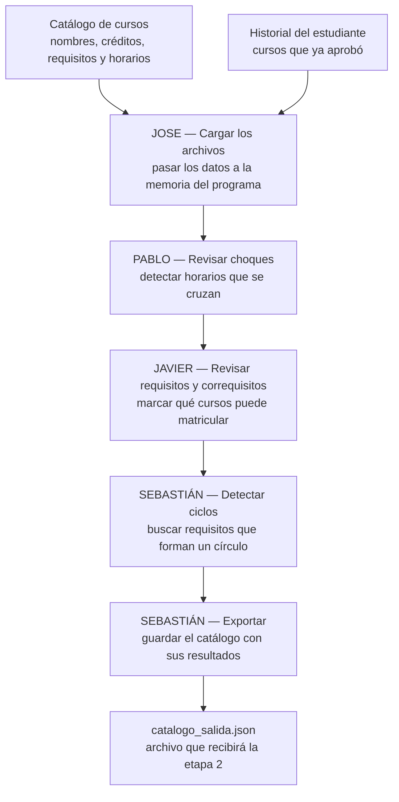

# CEmestre — Etapa 1 (Paradigma Imperativo, C)

> Parte 1 de 4 del proyecto [CEmestre](../README.md). Las demás etapas (Racket,
> Prolog, Java) viven en sus propias carpetas al nivel raíz del repositorio.

Programa en C que, a partir del catálogo de cursos de dos carreras y el
historial de un estudiante, calcula choques de horario, determina qué cursos
son matriculables según sus requisitos y correquisitos, detecta ciclos en el
grafo de requisitos y exporta el catálogo completo a un archivo JSON que sirve
de contrato para la siguiente etapa del proyecto (Racket).

## Equipo

| Integrante | Módulo |
|---|---|
| Jose | Carga de archivos |
| Pablo | Choques de horario |
| Javier | Requisitos, correquisitos y grafo |
| Sebastián | Exportación y detección de ciclos |

La distribución de tareas y el cronograma están en
[distribucion-tareas-etapa1-cemestre.md](distribucion-tareas-etapa1-cemestre.md).

## Cómo está organizado este documento

El enunciado pide documentar arquitectura (2.1), decisiones de diseño (2.2) y
estructuras de datos (2.3). Este README los cubre así:

| Punto del enunciado | Dónde está |
|---|---|
| 2.1 Arquitectura del proyecto | Sección 1, y el apartado *Arquitectura* de cada módulo en la sección 4 |
| 2.2 Decisiones de diseño | Sección 3 (transversales) y el apartado *Decisiones de diseño* de cada módulo |
| 2.2.2 Caso límite real | Sección 5 |
| 2.2.3 Justificación del formato de salida | Sección 6 |
| 2.3 Estructuras de datos | Sección 2 (compartidas) y el apartado *Estructuras de datos* de cada módulo |

---

## 1. Arquitectura del proyecto

### 1.1 Flujo del programa

El sistema no es un único ejecutable: cada etapa del proyecto es un programa
independiente que lee y escribe archivos. Esta etapa toma dos archivos JSON de
entrada, los procesa en memoria a través de cuatro módulos encadenados, y
produce un tercer archivo JSON.



`main.c` encadena los módulos en ese orden. Cada uno recibe las estructuras en
memoria, agrega su resultado y se lo pasa al siguiente; ninguno lee ni escribe
archivos salvo el primero y el último.

<!-- EQUIPO: si cambia el orden de llamadas en main.c, actualizar el diagrama. -->

### 1.2 Estructura de archivos

```
.
├── include/
│   ├── constantes.h     # limites, codigos de error y rutas por defecto
│   ├── estructuras.h    # structs base: BloqueHorario, Grupo, Curso, Catalogo, Historial
│   ├── carga.h          # Modulo 1 (Jose): carga de catalogo/historial
│   ├── choques.h        # Modulo 2 (Pablo): choques de horario
│   ├── requisitos.h     # Modulo 3 (Javier): requisitos/correquisitos + grafo
│   └── exportacion.h    # Modulo 4 (Sebastian): exportacion + deteccion de ciclos
├── src/
│   ├── main.c           # integracion de los 4 modulos
│   ├── carga.c
│   ├── choques.c
│   ├── requisitos.c
│   └── exportacion.c
├── data/                # archivos de entrada y salida, todos JSON
├── docs/                # documentacion detallada por modulo
├── tests/               # pruebas por modulo
├── lib/cjson/           # cJSON vendorizada (parseo/serializacion de JSON)
├── Makefile
└── distribucion-tareas-etapa1-cemestre.md
```

Cada módulo tiene su header en `include/` con las declaraciones públicas y su
implementación en `src/`. Los headers son el contrato entre módulos: un cambio
ahí afecta a todo el equipo.

### 1.3 Entradas y salida

Los tres archivos son JSON. El esquema completo de cada uno —nombres de campo,
anidamiento, tipos, y cómo se recolectaron y limpiaron los datos— está
documentado en **[`data/README.md`](data/README.md)**.

| Archivo | Rol |
|---|---|
| `data/catalogo.json` | Entrada. 45 cursos de los primeros 4 semestres de Ingeniería en Computadores e Ingeniería en Producción Industrial. |
| `data/historial.json` | Entrada. 25 códigos de cursos ya aprobados por un estudiante de prueba. |
| `data/catalogo_salida.json` | Salida. El catálogo completo más los campos calculados. Contrato con la etapa 2. |

---

## 2. Compilar y ejecutar

Requiere `gcc` y `make`.

> **Windows:** correr `make` desde **Git Bash** (no PowerShell ni cmd.exe). El
> Makefile usa comandos estilo Unix (`rm -rf`, `mkdir -p`); si `make` no
> encuentra un shell POSIX (`sh.exe`) en el PATH, cae de vuelta a `cmd.exe`,
> que no entiende esos comandos y falla con errores como
> `CreateProcess(NULL, rm -rf build bin, ...) failed`. Git Bash ya viene
> instalado junto con Git y resuelve esto sin tocar el Makefile.

```bash
make            # compila bin/cemestre
make run        # compila y ejecuta con las rutas por defecto de constantes.h
make clean      # borra los artefactos de compilacion (build/, bin/)
```

Rutas por defecto (ver `include/constantes.h`): `data/catalogo.json`,
`data/historial.json`, `data/catalogo_salida.json`. También se pueden pasar
como argumentos:

```bash
./bin/cemestre data/catalogo.json data/historial.json data/catalogo_salida.json
```

El programa imprime por `stderr` un aviso por cada requisito que no logra
resolver dentro del catálogo. Con el dataset actual son dos avisos, ambos del
curso `CI1230`; no son errores (ver sección 5).

---

## 3. Estructuras de datos compartidas

Definidas en `include/estructuras.h`, con los límites en `include/constantes.h`.
Son el contrato contra el que trabajan los cuatro módulos.

<!-- EQUIPO (idealmente Jose, que definió los structs):
     Explicar cada struct y por qué se modeló así. Puntos a cubrir:
     - BloqueHorario: por que el dia es un char y las horas son int en formato
       HHMM en vez de strings, y por que se usa 'K' para martes.
     - Grupo: por que un grupo tiene un arreglo de bloques y no uno solo.
     - Curso: por que 'carreras' es un arreglo (cursos compartidos entre los dos
       planes) en vez de duplicar la entrada del curso.
     - Catalogo e Historial: por que arreglos estaticos y no memoria dinamica,
       y que implica eso para liberar_catalogo/liberar_historial.
     - Mencionar por que las constantes viven en un archivo aparte
       (es requisito explicito del enunciado). -->

---

## 4. Módulos

### 4.1 Módulo de carga — Jose

Archivos: `include/carga.h`, `src/carga.c`.

#### 4.1.1 Arquitectura

<!-- JOSE: que hace el modulo dentro del flujo, que recibe y que entrega.
     Mencionar las funciones publicas (cargar_catalogo, cargar_historial,
     liberar_catalogo, liberar_historial) y los helpers internos
     (leer_archivo_completo, copiar_seguro, cargar_lista_codigos,
     cargar_curso). Quien lo llama: main.c, antes que todos los demas. -->

#### 4.1.2 Decisiones de diseño

<!-- JOSE: justificar con ejemplos del dataset. Puntos sugeridos:
     - Por que cJSON vendorizada en lugar de un parser propio
       (ver lib/cjson/README.md) y que implica para la compilacion.
     - Por que se lee el archivo completo a memoria con MAX_TAMANO_JSON
       en vez de parsear linea por linea.
     - Por que se abre en modo binario "rb" y no en modo texto.
     - Por que se usa strncpy con terminador explicito (copiar_seguro)
       en vez de strcpy.
     - Que campos se consideran obligatorios (codigo, nombre, creditos ->
       ERROR_FORMATO si faltan) y cuales opcionales (grupos, requisitos y
       correquisitos vacios son validos, no son error).
     - Los codigos de error de constantes.h y cuando se devuelve cada uno. -->

#### 4.1.3 Estructuras de datos

<!-- JOSE: como se mapea el JSON a los structs. El detalle importante es que
     los nombres de campo del JSON son identicos a los de los struct, a
     proposito, para que el parseo sea un mapeo directo. Mencionar el caso del
     campo 'dia', que en JSON es string de un caracter y en el struct es char. -->

---

### 4.2 Módulo de choques de horario — Pablo

Archivos: `include/choques.h`, `src/choques.c`.

#### 4.2.1 Arquitectura

<!-- PABLO: que hace el modulo y donde entra en el flujo. Las tres funciones
     (bloques_se_solapan, grupos_chocan, calcular_choques) y como se apoyan una
     en otra: bloque -> grupo -> catalogo. Que escribe: el campo
     choca_con_otro de cada Curso. -->

#### 4.2.2 Decisiones de diseño

<!-- PABLO: justificar. Puntos sugeridos:
     - La comparacion usa intervalo semiabierto [inicio, fin): un curso que
       termina a las 9:20 y otro que empieza a las 9:20 NO chocan. Explicar
       por que es lo correcto.
     - Por que el formato HHMM como entero permite comparar horas con < y >
       sin convertir nada.
     - Que significa exactamente "chocar" en esta implementacion: se comparan
       cursos DISTINTOS entre si (el ciclo interno arranca en j = i+1), no los
       grupos de un mismo curso.
     - LIMITACION IMPORTANTE que conviene documentar: con el dataset real los
       45 cursos quedan marcados con choca_con_otro = 1, porque basta con que
       un grupo cualquiera de un curso choque con un grupo cualquiera de otro.
       A nivel de grupo solo el 11% de las combinaciones chocan. Explicar que
       el campo cumple el minimo que pide el enunciado, y que la resolucion
       fina (elegir un grupo por curso) le corresponde a la etapa de Racket. -->

#### 4.2.3 Estructuras de datos

<!-- PABLO: que campos de BloqueHorario, Grupo y Curso usa el modulo. No
     define estructuras propias: trabaja sobre las compartidas. Explicar por
     que no necesito ninguna estructura auxiliar. -->

---

### 4.3 Módulo de requisitos y matriculabilidad — Javier

#### 4.3.1 Arquitectura

Este módulo define, para cada curso de catálogo, si el estudiante puede matricularlo,
según los requisitos y correquisitos del mismo.
Esto se logra comparando los requisitos y correquisitos declarados por
el curso contra el historial de cursos aprobados, y queda escrita en el campo
`matriculable` de cada `Curso`.

Además, construye el **grafo de requisitos**, una lista de adyacencia donde cada
curso apunta a los cursos que son requisito directo suyo.

Entra al flujo en dos momentos: `determinar_matriculable()` lo llama `main.c`
después del cálculo de choques, y `construir_grafo_requisitos()` lo llama
`detectar_ciclos()` desde `exportacion.c`. Las dos entradas son independientes
entre sí.

En `main.c` se hace la llamada a `determinar_matriculable()` después del cálculo de choques,
y `construir_grafo_requisitos()` se llama desde `exportacion.c`. Ambas entradas son independientes
entre sí.

#### 4.3.2 Decisiones de diseño

- **Semántica de correquisitos.** Un correquisito se debe llevar al mismo tiempo que
  el curso, así que no se puede exigir que esté aprobado. Un correquisito 
  se cumple si ya está aprobado, o si existe en el catálogo. Esta condición no es
  recursiva ya que en el dataset hay correquisitos mutuos.
  Por ejemplo: (`QU1102`↔`QU1106` y `QU1104`↔`QU1107`) donde una implementación recursiva
  no terminaría.
- **`matriculable` no toma en cuenta `choca_con_otro`.** La etapa de choque
  entre dos cursos no corresponde a la etapa1-c, esto es resuelto durante la etapa
  de etapa2-racket.
- **Los cursos ya aprobados quedan en `matriculable = 0`.** Se les define este valor
  a los cursos que el estudiante puede matricular ese semestre.
- **El grafo guarda índices, no códigos.** El DFS salta de nodo a nodo, ya que
  al utilziar índices el salto es directo, con strings cada paso sería una búsqueda lineal.

#### 4.3.3 Estructuras de datos

El módulo define `GrafoRequisitos` en `include/requisitos.h` una lista de
adyacencia sobre arreglos estáticos, donde `adyacentes[i][k]` es el índice del
k-ésimo curso que es requisito del curso `i`, `cantidad_adyacentes[i]` cuántos
tiene, y `cantidad_nodos` el total de nodos. Una arista `i -> j` se lee como
"el curso i tiene como requisito al curso j".

De las estructuras compartidas lee `codigo`, `requisitos[]`, `correquisitos[]`
y `aprobados[]`, y define únicamente `matriculable`.

Sobre el dataset real define **12 cursos matriculables de 45**, y un grafo de 45
nodos con 35 aristas.

### 4.4 Módulo de exportación y detección de ciclos — Sebastián

Archivos: `include/exportacion.h`, `src/exportacion.c`.

#### 4.4.1 Arquitectura

La exportación utiliza cJSON y conserva todos los cursos, carreras, requisitos,
correquisitos, grupos y bloques horarios. Los indicadores `choca_con_otro` y
`matriculable` se escriben como booleanos JSON.

La detección de ciclos utiliza el grafo de requisitos construido por el módulo
de requisitos. Mediante DFS se mantienen los nodos visitados y los que siguen
en la pila activa; una conexión hacia un nodo de esa pila identifica un ciclo,
cuyo recorrido se imprime con los códigos de los cursos involucrados. Se
recorren todos los componentes del grafo.

<!-- SEBASTIAN: agregar si hace falta las funciones publicas (exportar_catalogo,
     dfs_detectar_ciclo, detectar_ciclos) y en que orden las llama main.c. -->

#### 4.4.2 Decisiones de diseño

Se eligió JSON porque representa directamente la estructura de cursos, grupos y
horarios, y permite que la etapa de Racket lea los datos sin necesitar un
formato de texto personalizado.

Los correquisitos no se incluyen en la detección de ciclos, ya que pueden
representar matrícula simultánea. Incluirlos haría que los pares mutuos del
dataset (`QU1102`↔`QU1106`, `QU1104`↔`QU1107`) se reportaran como ciclos
falsos.

<!-- SEBASTIAN: valdria la pena documentar tambien:
     - Por que el JSON completo se construye en memoria ANTES de abrir el
       archivo de salida (no queda un archivo a medias si algo falla).
     - Por que se validan los limites y terminadores del catalogo
       (catalogo_valido) antes de serializar.
     - Por que los ciclos van en el archivo de salida ademas de imprimirse
       en terminal. -->

#### 4.4.3 Estructuras de datos

La salida JSON incluye, además de `cursos`, los campos `ciclos` y `hay_ciclos`.
Cada elemento de `ciclos` contiene los códigos de un recorrido cerrado
detectado mediante DFS, repitiendo el código inicial al final. Si no se
detectan ciclos se exportan `[]` y `false`, respectivamente.

<!-- SEBASTIAN: describir tambien las estructuras internas del DFS (los
     arreglos visitados, en_pila y camino) y por que hacen falta los tres. -->

---

## 5. Casos límite encontrados

<!-- EQUIPO: el enunciado (2.2.2) pide UN caso limite real y como se resolvio.
     Abajo esta el que documento Sebastian. En data/README.md hay varios mas
     ya documentados (los codigos SE y FH que no existen en la oferta real, los
     cursos con mas secciones que MAX_GRUPOS, los conflictos entre los dos
     planes de estudio); si se quiere, enlazarlos desde aqui en vez de
     repetirlos. -->

**Requisitos que no existen en el catálogo.** `CI1230` (Inglés I) declara los
requisitos `CI0200` y `CI0202`, cursos de nivelación que no están en el
catálogo de los primeros 4 semestres. Son los únicos dos casos del dataset: de
los 37 requisitos declarados, 35 se resuelven y estos 2 no.

El grafo **omite** esas aristas y avisa por `stderr`, porque no puede apuntar a
un nodo inexistente; la exportación **conserva** ambos códigos en el archivo de
salida; y la validación de requisitos **sí los cuenta como incumplidos**, así
que `CI1230` queda con `matriculable: false`. El tratamiento distinto en cada
módulo es deliberado: el grafo sirve para verificar integridad de los datos y
la validación para decidir matrícula.

La consecuencia conocida es que no se pueden detectar ciclos que dependan de
cursos ausentes del catálogo.

---

## 6. Justificación del formato de salida

<!-- EQUIPO: el enunciado (2.2.3) pide que la justificacion este "ligada a una
     decision de diseno real", no una defensa generica de JSON. Lo que ya esta
     escrito abajo es el punto de partida; conviene agregar al menos una de
     estas decisiones concretas:
     - Por que los nombres de campo del JSON son identicos a los de los struct.
     - Por que 'carreras' se agrego al esquema aunque el enunciado no lo pide
       (el catalogo mezcla dos carreras en un solo archivo).
     - Por que choca_con_otro y matriculable son booleanos JSON nativos y no
       0/1, pensando en quien lee el archivo desde Racket.
     - Por que 'ciclos' y 'hay_ciclos' van al mismo nivel que 'cursos' y no
       dentro de cada curso.
     - Por que el archivo de salida repite todo el catalogo de entrada en vez
       de traer solo los campos calculados. -->

El archivo de salida usa el mismo formato JSON que las entradas. Se eligió
porque representa directamente la estructura anidada de cursos, grupos y
bloques horarios, y porque la etapa de Racket puede leerlo sin escribir un
parser para un formato de texto propio.

El esquema completo del archivo de salida está en
[`data/README.md`](data/README.md).

---

## 7. Pruebas

Cada módulo tiene sus pruebas en `tests/`, en una carpeta por módulo. Se
compilan por separado y no dependen de los archivos de datos: arman las
estructuras a mano en memoria.

```bash
# requisitos y correquisitos (Javier)
gcc -Wall -Wextra -std=c11 -Iinclude -Ilib/cjson -g \
    tests/requisitos/test_requisitos.c src/requisitos.c -o build/test_requisitos && \
    ./build/test_requisitos

# grafo de requisitos (Javier)
gcc -Wall -Wextra -std=c11 -Iinclude -Ilib/cjson -g \
    tests/grafo-requisitos/test_grafo.c src/requisitos.c -o build/test_grafo && \
    ./build/test_grafo
```

<!-- EQUIPO: agregar aqui los comandos de las pruebas de exportacion/ciclos y,
     si se escriben, las de carga y choques. -->

### Valores de referencia sobre el dataset real

Sirven para verificar cualquier cambio futuro:

| Métrica | Valor |
|---|---|
| Cursos cargados | 45 |
| Cursos aprobados en el historial | 25 |
| Cursos matriculables | 12 |
| Grupos / bloques horarios | 206 / 295 |
| Requisitos declarados / sin resolver | 37 / 2 |
| Nodos y aristas del grafo | 45 / 35 |
| Ciclos detectados | 0 |

---

## 8. Flujo de trabajo del repositorio

- `main` recibe únicamente los merges de `develop` ya verificados (build limpio
  y módulos probados). No se comitea directo a `main`.
- `develop` es la rama de integración: todo el trabajo del día a día pasa por
  ahí.
- Cada quien trabaja en su rama de feature a partir de `develop`
  (`feature/cargar-horarios`, `feature/choques`, `feature/requisitos`,
  `feature/grafo-requisitos`, `feature/exportacion-ciclos`) y la integra a
  `develop` mediante pull request conforme se prueba.
- `main.c` se completa en conjunto, en `develop`, una vez que cada módulo está
  probado por separado.
- Cuando la etapa está completa y verificada en `develop`, se hace merge a
  `main` como entrega final.

Más detalle de cronograma y checklist de entregables en
[distribucion-tareas-etapa1-cemestre.md](distribucion-tareas-etapa1-cemestre.md).
